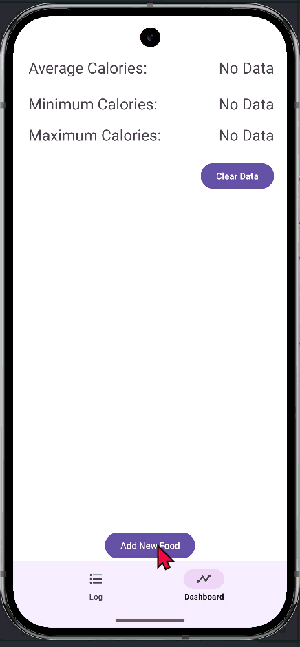

# Android Project 6 - *Bit Fit part 2 *

Submitted by: **Robell A**

**Bit Fit** is a health metrics app that allows users to track ... [TODO] 

Time spent: **X** hours spent in total

## Required Features

The following **required** functionality is completed:

- [x] **Use at least 2 Fragments**
- [x] **Create a new dashboard fragment where users can see a summary of their entered data**
- [x] **Use one of the Navigation UI Views (BottomNavigation, Drawer Layout, Top Bar) to move between the fragments**

## Video Walkthrough

Here's a walkthrough of implemented user stories:

## Notes

Describe any challenges encountered while building the app.

## License

